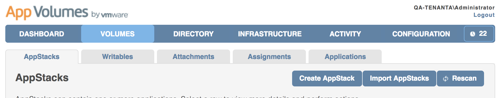
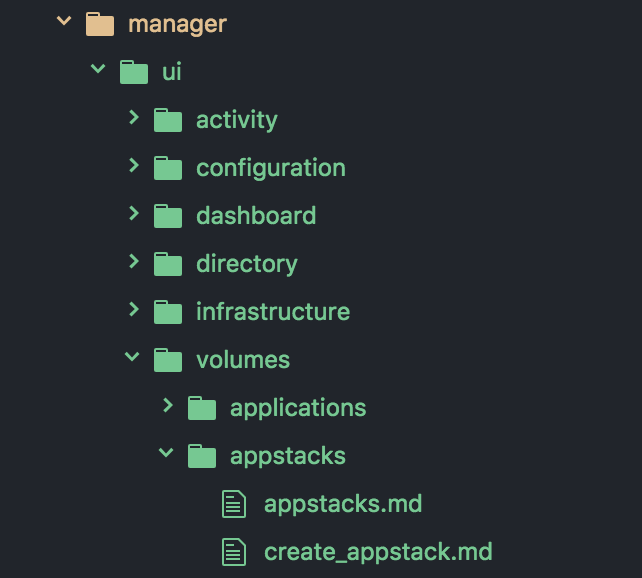

## AppVolumes Internal documents repository
This is our `engineering driven` internal documents repository for AppVolumes 2.x product.

### Structure
`docs` folder contains actual document contents. All `.md` files are placed under corresponding directory path. Please refer `SUMMARY.md` for structure overview.

***Note*** in `docs/manager/features`,
Directory structures represent hierarchy of functional menus. Also each `.md` files corresponds to feature level.

Note that path to `create_appstack.md` represent menu structure from the `Admin UI`

### Templates
These are pre-baked templates for different categories
- Basic
- Feature Introduction
- How to do xx
- Q&A
